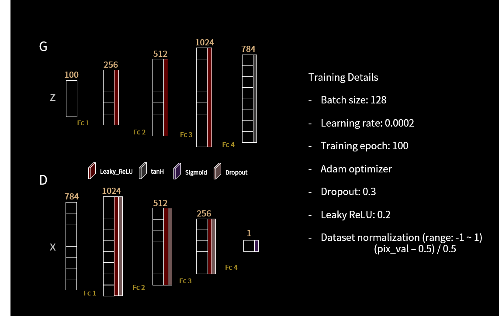
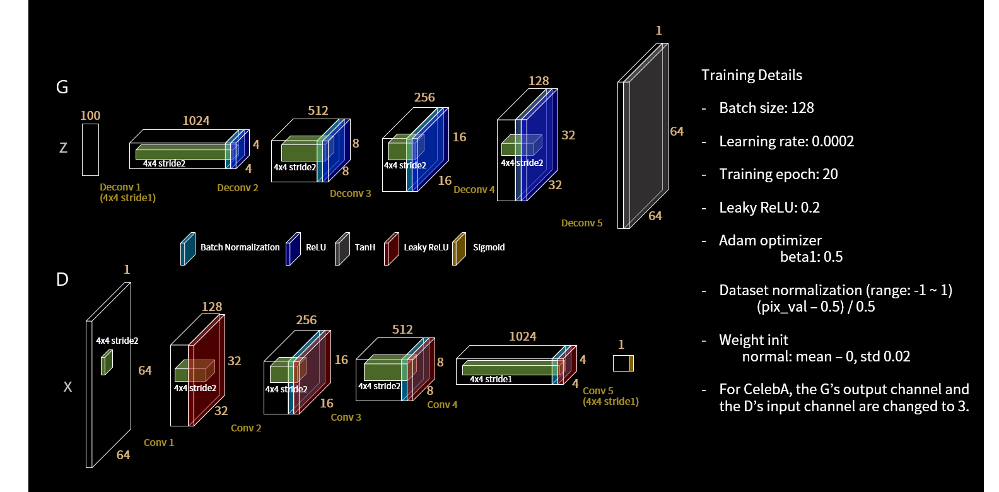
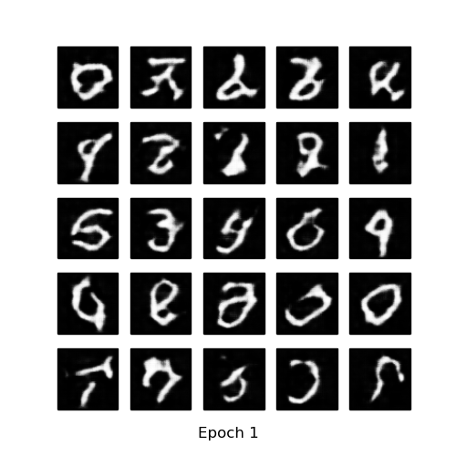
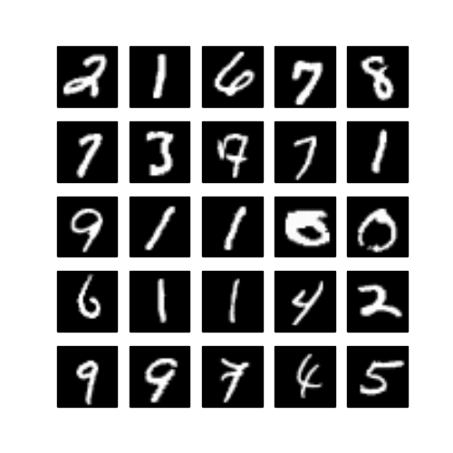
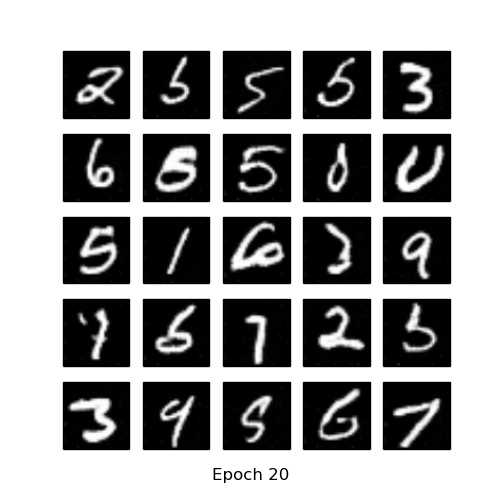
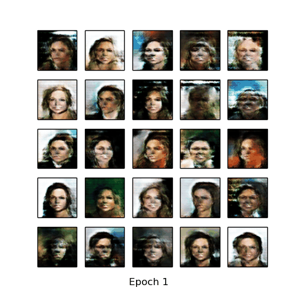
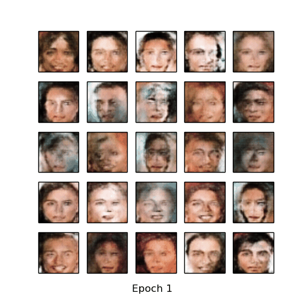
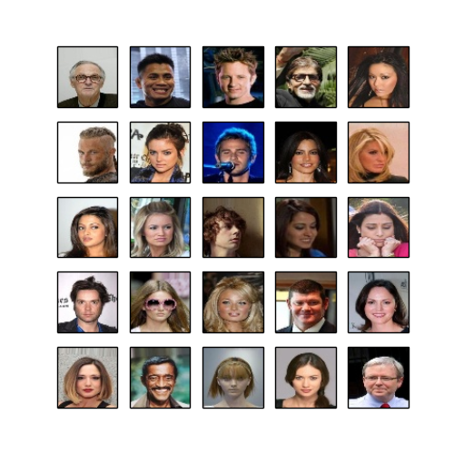
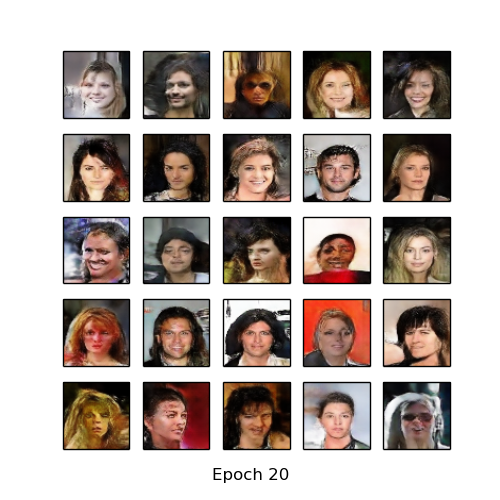
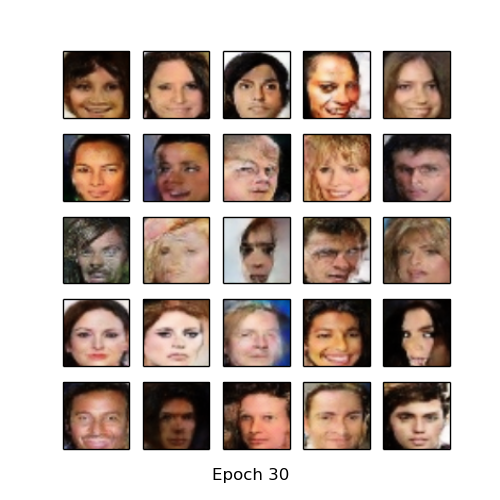

# pytorch-MNIST-CelebA-GAN-DCGAN
Pytorch implementation of Generative Adversarial Networks (GAN) [1] and Deep Convolutional Generative Adversarial Networks (DCGAN) [2] for MNIST [3] and CelebA [4] datasets.

* If you want to train using cropped CelebA dataset, you have to change isCrop = False to isCrop = True.

* you can download
  - MNIST dataset: http://yann.lecun.com/exdb/mnist/
  - CelebA dataset: http://mmlab.ie.cuhk.edu.hk/projects/CelebA.html

* pytorch_CelebA_DCGAN.py requires 64 x 64 size image, so you have to resize CelebA dataset (celebA_data_preprocess.py).
* pytorch_CelebA_DCGAN.py added learning rate decay code.

## Implementation details
* GAN

* DCGAN

## Resutls
### MNIST
* Generate using fixed noise (fixed_z_)

<table align='center'>
<tr align='center'>
<td> GAN</td>
<td> DCGAN</td>
</tr>
<tr>
<td>
<td>
</tr>
</table>

* MNIST vs Generated images

<table align='center'>
<tr align='center'>
<td> MNIST </td>
<td> GAN after 100 epochs </td>
<td> DCGAN after 20 epochs </td>
</tr>
<tr>
<td>
<td>
<td>
</tr>
</table>

* Training loss
  * GAN

* Learning Time
  * MNIST DCGAN - Avg. per epoch: 197.86 sec; (if you want to reduce learning time, you can change 'generator(128)' and 'discriminator(128)' to 'generator(64)' and 'discriminator(64)' ... then Avg. per epoch: about 67sec in my development environment.)
  
### CelebA
* Generate using fixed noise (fixed_z_)

<table align='center'>
<tr align='center'>
<td> DCGAN </td>
<td> DCGAN crop </td>
</tr>
<tr>
<td>
<td>
</tr>
</table>

* CelebA vs Generated images

<table align='center'>
<tr align='center'>
<td> CelebA </td>
<td> DCGAN after 20 epochs </td>
<td> DCGAN crop after 30 epochs </td>
</tr>
<tr>
<td>
<td>
<td>
</tr>
</table>

* Learning Time
  * CelebA DCGAN - Avg. per epoch: 732.54 sec; total 20 epochs ptime: 14744.66 sec

## Development Environment

* Ubuntu 14.04 LTS
* NVIDIA GTX 1080 ti
* cuda 8.0
* Python 2.7.6
* pytorch 0.1.12
* torchvision 0.1.8
* matplotlib 1.3.1
* imageio 2.2.0
* scipy 0.19.1

## Reference

[1] Goodfellow, Ian, et al. "Generative adversarial nets." Advances in neural information processing systems. 2014.

(Full paper: http://papers.nips.cc/paper/5423-generative-adversarial-nets.pdf)

[2] Radford, Alec, Luke Metz, and Soumith Chintala. "Unsupervised representation learning with deep convolutional generative adversarial networks." arXiv preprint arXiv:1511.06434 (2015).

(Full paper: https://arxiv.org/pdf/1511.06434.pdf)

[3] Y. LeCun, L. Bottou, Y. Bengio, and P. Haffner. "Gradient-based learning applied to document recognition." Proceedings of the IEEE, 86(11):2278-2324, November 1998.

[4] Liu, Ziwei, et al. "Deep learning face attributes in the wild." Proceedings of the IEEE International Conference on Computer Vision. 2015.
